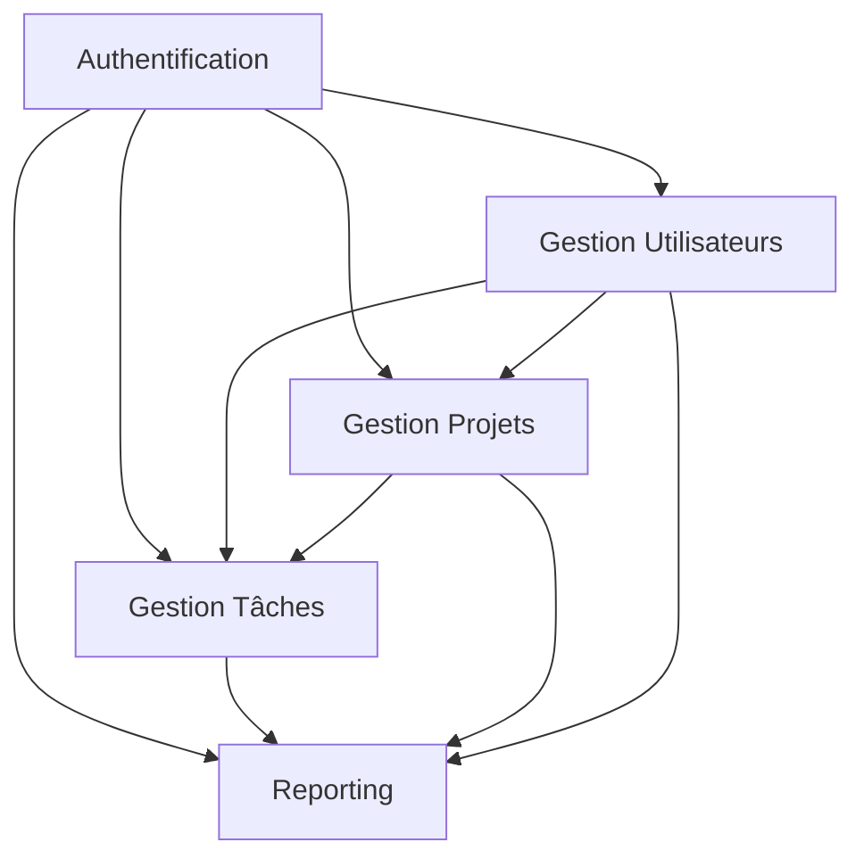

# 📈 Synthèse des Modules - Analyse Globale

## Introduction

Ce document présente une synthèse de l'analyse détaillée de chaque module de la plateforme de gestion Camtel, avec une vision consolidée des charges, délais et interdépendances.

---

## 📊 Vue d'Ensemble des Modules

| Module | Charge Nette (pmois) | Durée (mois) | Développeurs | Complexité |
|--------|---------------------|--------------|--------------|------------|
| Authentification | 7.9 | 4.6 | 2 | Élevée |
| Gestion Utilisateurs | 9.7 | 5.3 | 2 | Moyenne |
| Gestion Projets | 8.7 | 5.1 | 2 | Moyenne-Élevée |
| Gestion Tâches | 7.2 | 4.8 | 2 | Moyenne |
| Reporting | 6.6 | 4.5 | 2 | Moyenne-Élevée |
| **TOTAL** | **40.1** | **~6.5** | **6** | **Variable** |

---

## 🔄 Interdépendances des Modules

### Dépendances Techniques

### Ordre de Développement Recommandé

1. **Phase 1** : Authentification (fondation)
2. **Phase 2** : Gestion Utilisateurs (ressources)
3. **Phase 3** : Gestion Projets (structure)
4. **Phase 4** : Gestion Tâches (opérationnel)
5. **Phase 5** : Reporting (analytique)

---

## 📅 Planification Globale

### Chronogramme Détaillé

| Mois | 1 | 2 | 3 | 4 | 5 | 6 | 7 |
|------|---|---|---|---|---|---|---|
| Authentification | ████ | ████ | | | | | |
| Gestion Utilisateurs | | ████ | ████ | ████ | | | |
| Gestion Projets | | | ████ | ████ | ████ | | |
| Gestion Tâches | | | | ████ | ████ | ████ | |
| Reporting | | | | | | ████ | ████ |

### Répartition par Phase

**Phase 1 (Mois 1-2)** : Fondation
- Authentification complète
- Base de données commune

**Phase 2 (Mois 2-4)** : Gestion
- Utilisateurs et Projets
- Intégration modules

**Phase 3 (Mois 4-6)** : Opérationnel
- Tâches et workflows
- Tests intégration

**Phase 4 (Mois 6-7)** : Analytique
- Reporting et dashboards
- Optimisation finale

---

## 👥 Allocation des Ressources

### Équipe de Développement

**Composition** : 6 développeurs

**Répartition par expertise** :
- 2 développeurs Backend (Laravel/PHP)
- 2 développeurs Frontend (Blade/Livewire)
- 1 développeur Full-stack (Reporting)
- 1 développeur QA/Tests

### Taux d'Utilisation

| Module | Développeurs | Taux Utilisation |
|--------|--------------|------------------|
| Authentification | 2 | 100% |
| Gestion Utilisateurs | 2 | 85% |
| Gestion Projets | 2 | 90% |
| Gestion Tâches | 2 | 95% |
| Reporting | 2 | 80% |

---

## 💰 Consolidation des Charges

### Analyse COCOMO Globale

**Paramètres agrégés** :
- KLOC total : ~12,700
- Type de projet : Semi-detached
- Facteurs correcteurs : 0.85

**Résultats consolidés** :
- **Charge brute** : 51.9 personnes-mois
- **Charge nette** : 44.1 personnes-mois
- **Durée totale** : 7.3 mois
- **Équipe optimale** : 6 développeurs

### Répartition par Catégorie

| Catégorie | Charge (pmois) | Pourcentage |
|-----------|----------------|-------------|
| Développement | 32.5 | 74% |
| Tests | 6.2 | 14% |
| Documentation | 3.1 | 7% |
| Gestion de projet | 2.3 | 5% |

---

## 🎯 Risques et Mitigations

### Risques Techniques

| Risque | Impact | Probabilité | Mitigation |
|--------|--------|-------------|------------|
| Complexité authentification | Élevé | Moyenne | Expertise sécurité externe |
| Performance reporting | Moyen | Élevée | Cache Redis, vues matérialisées |
| Intégration modules | Élevé | Moyenne | Tests intégration continus |

### Risques Organisationnels

| Risque | Impact | Probabilité | Mitigation |
|--------|--------|-------------|------------|
| Perte développeurs | Élevé | Moyenne | Documentation complète |
| Changements périmètre | Moyen | Élevée | Gestion formelle changements |
| Retard livraison | Moyen | Moyenne | Buffer 15% planning |

---

## 📈 Métriques de Suivi

### KPI de Développement

**Productivité** :
- LOC/développeur/mois : 285
- Tests/couverture : 85%
- Bugs/KLOC : < 0.5

**Qualité** :
- Revues de code : 100%
- Tests automatisés : 80%
- Documentation : 90%

### KPI de Performance

**Temps de réponse** :
- Authentification : < 1s
- CRUD utilisateurs : < 2s
- Reporting dashboards : < 3s

**Disponibilité** :
- Uptime cible : 99.5%
- Temps de récupération : < 1h

---

## 🔮 Évolutions Futures

### Court Terme (6-12 mois)

**Module Messagerie** :
- Charge estimée : 5.2 pmois
- Durée : 3.5 mois
- Complexité : Moyenne

**Application Mobile** :
- Charge estimée : 8.5 pmois
- Durée : 5 mois
- Complexité : Élevée

### Moyen Terme (1-2 ans)

**Intelligence Artificielle** :
- Prédictions de projets
- Optimisation ressources
- Charge estimée : 12.3 pmois

**Multi-entreprises** :
- Gestion multi-tenant
- Isolation données
- Charge estimée : 10.7 pmois

---

## 💡 Recommandations Stratégiques

### Recommandations Techniques

1. **Prioriser l'authentification** : Module critique pour sécurité
2. **Standardiser les APIs** : Faciliter intégrations futures
3. **Automatiser les tests** : Garantir qualité continue
4. **Optimiser les requêtes** : Performance à grande échelle

### Recommandations Organisationnelles

1. **Formation continue** : Maintenir expertise technique
2. **Documentation exhaustive** : Réduire dépendance individuelle
3. **Veille technologique** : Anticiper évolutions
4. **Retour utilisateur** : Amélioration continue

### Recommandations Budgétaires

**Investissement initial** :
- Développement : 44.1 pmois
- Infrastructure : 15% du total
- Formation : 5% du total
- Contingence : 10% du total

**Maintenance annuelle** :
- Évolutions : 20% du coût initial
- Support : 10% du coût initial
- Formation : 5% du coût initial

---

## 🎯 Conclusion

### Synthèse Globale

La plateforme de gestion Camtel représente un projet ambitieux mais réalisable avec une charge totale de **44.1 personnes-mois** sur **7.3 mois** pour une équipe de **6 développeurs**.

### Points Forts du Projet

**1. Architecture cohérente** : Modules bien définis avec interdépendances claires
**2. Équipe équilibrée** : Répartition optimale des compétences
**3. Planning réaliste** : Phasage logique avec buffers intégrés
**4. Qualité intégrée** : Tests et documentation dès le départ

### Facteurs de Succès Clés

**1. Leadership fort** : Sponsorisation au niveau exécutif
**2. Équipe stable** : Maintenir les compétences tout au long du projet
**3. Communication** : Transparence sur avancement et défis
**4. Flexibilité** : Capacité d'adaptation aux changements

### Impact Attendu

**Quantitatif** :
- Productivité globale : +35%
- Réduction erreurs : -45%
- Temps décision : -60%

**Qualitatif** :
- Visibilité accrue
- Collaboration améliorée
- Excellence opérationnelle

Ce projet positionnera Camtel comme une référence en matière de gestion de projets numériques, avec un retour sur investissement significatif tant sur le plan humain que financier.

---

*Document de synthèse - 27 mars 2026*
*Direction de la Transition Numérique - Camtel*
